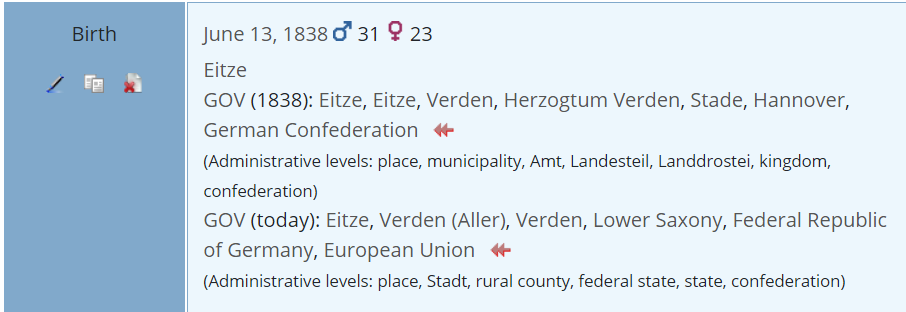
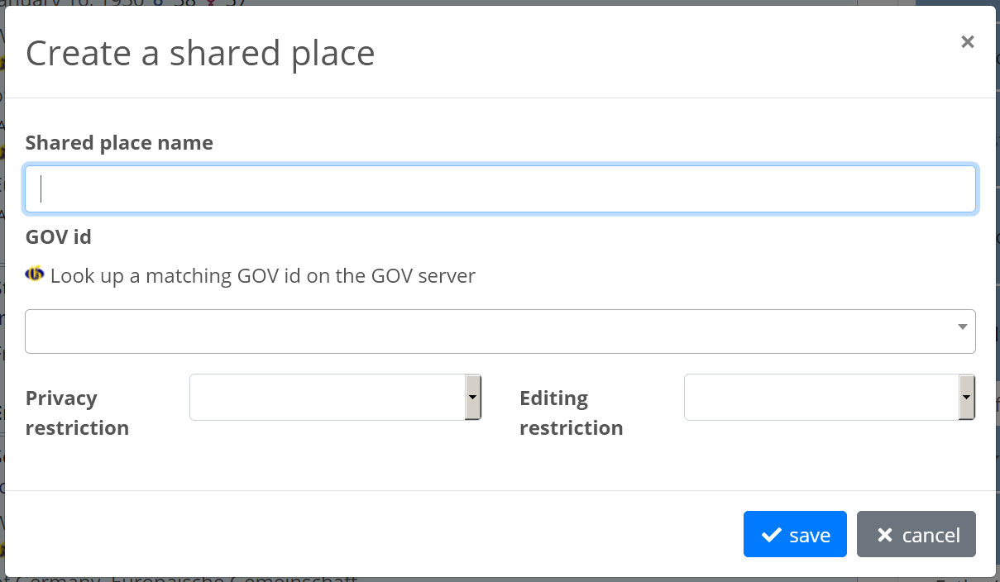

# ⚶ Vesta Gov4Webtrees (Webtrees Custom Module)

This [webtrees](https://www.webtrees.net/) custom module provides data to an extended 'Facts and Events' tab, enhancing events with [GOV](http://gov.genealogy.net) (historic gazetteer) data.
The project’s website is [cissee.de](https://cissee.de).

See [here](https://github.com/vesta-webtrees-2-custom-modules/vesta_common/blob/master/docs/LocationData.md) for an overview of location data management in webtrees.

## Contents

* [Features](#features)
* [Disclosure to third parties](#disclosure)
* [Demo](#demo)
* [Download](#download)
* [Installation](#installation)
* [License](#license)

### Features<a name="features"/>

* Historic and current GOV data is loaded from the GOV server, cached internally, and displayed for individual facts and events. 
* Location data (map coordinates) is also used, if available, for map links and other custom modules.
* GOV ids have to be entered manually, once per place name. They may be managed in different ways (depending on the module administration settings):

1. GOV ids outside GEDCOM data. In this case, the GOV ids are stored in a separate database table, which has to be managed manually when moving the respective tree to a different webtrees installation.
Note that the edit controls have been moved: They are now grouped with the other edit controls (circled red in the screenshot).

2. GOV ids within GEDCOM data. GOV ids may also be set via the Shared Places module. In this case, they are exported via GEDCOM data.
Here, the GOV icon grouped with the edit controls just reloads the place hierarchy from the GOV server. 
When creating or updating shared places, the GOV id edit controls are supported:

3. Alternatively, GOV ids may always be set via a custom _GOV tag under the respective PLAC tag (for a specific fact or event). This is not recommended, and there are no edit controls to support this. The module still displays the place hierarchies in this case though.

### Disclosure to third parties<a name="disclosure"/>

Data is obtained from the GOV server via webservices, as described [here](http://gov.genealogy.net/services/). 
The module only uses these webservices to read data, the 'ChangeService', which would require a username and password, is not used.
At no point any kind of personal information related to the webtrees user is transferred, nor the user's IP address.
You may still prefer to point out the use of this third party in your website's privacy policy.

### Download<a name="download"/>

* Current version: 2.2.4.0.0
* Based on and tested with webtrees 2.2.4. Requires webtrees 2.2.1 or later.
* Requires the ⚶ Vesta Common module ('vesta_common').
* Displays data via the ⚶ Vesta Facts and events module ('vesta_personal_facts'). 
* Provides location data to other custom modules.
* Download the zip file, which includes all Vesta modules, [here](https://cissee.de/vesta.latest.zip).
* Support, suggestions, feature requests: <ric@richard-cissee.de>
* Issues also via <https://github.com/vesta-webtrees-2-custom-modules/vesta_gov4webtrees/issues>
* Translations may be contributed via weblate: <https://hosted.weblate.org/projects/vesta-webtrees-custom-modules/>

### Installation<a name="installation"/>

* Unzip the files and copy the contents of the modules_v4 folder to the respective folder of your webtrees installation. All related modules are included in the zip file. It's safe to overwrite the respective directories if they already exist (they are bundled with other custom modules as well), as long as other custom models using these dependencies are also upgraded to their respective latest versions.
* Enable the extended 'Facts and Events' module via Control Panel -> Modules -> All modules -> ⚶ Vesta Facts and Events.
* Enable the main module via Control Panel -> Modules -> All modules -> ⚶ Vesta Gov4Webtrees. After that, you may configure some options.
* Configure the visibility of the old and the extended 'Facts and Events' tab via Control Panel -> Modules -> Tabs (usually, you'll want to use only one of them. You may just disable the original 'Facts and Events' module altogether).
				
#### Import/Export

If you want to transfer GOV data between different webtrees instances, you only have to copy the table which maps place names to gov ids (##gov_ids), all other data will be re-created automatically.
If you use GEDCOM data with _GOV tags for GOV ids (either directly or via the Shared Places module), even this step is unnecessary.

### License<a name="license"/>

* **gov4webtrees: a webtrees custom module**
* Copyright (C) 2019 – 2025 Richard Cissée
* Derived from **webtrees** - Copyright 2022 webtrees development team.
* Uses third-party libraries that are distributed under their own terms (see below)
* Nutzt Daten des [Geschichtlichen Orts-Verzeichnisses GOV](http://gov.genealogy.net) des [Vereins für Computergenealogie e. V.](http://compgen.de), basierend auf einer [Creative Commons-Lizenz](http://wiki-de.genealogy.net/GOV/Webservice#Lizenz).
* Dutch translations provided by TheDutchJewel.
* Slovak translations provided by Ladislav Rosival.
* Czech translations provided by Josef Prause.
* Further translations contributed via weblate.

This program is free software: you can redistribute it and/or modify
it under the terms of the GNU General Public License as published by
the Free Software Foundation, either version 3 of the License, or
(at your option) any later version.

This program is distributed in the hope that it will be useful,
but WITHOUT ANY WARRANTY; without even the implied warranty of
MERCHANTABILITY or FITNESS FOR A PARTICULAR PURPOSE. See the
GNU General Public License for more details.

You should have received a copy of the GNU General Public License
along with this program. If not, see <http://www.gnu.org/licenses/>.

#### Third-party libraries

gov4webtrees uses the following third-party libraries:

| Software | Version | License |
|---|---|---|
| [NuSOAP](https://github.com/f00b4r/nusoap) | v0.9.15 | [LGPL-2.0-only](https://packagist.org/packages/econea/nusoap) |
